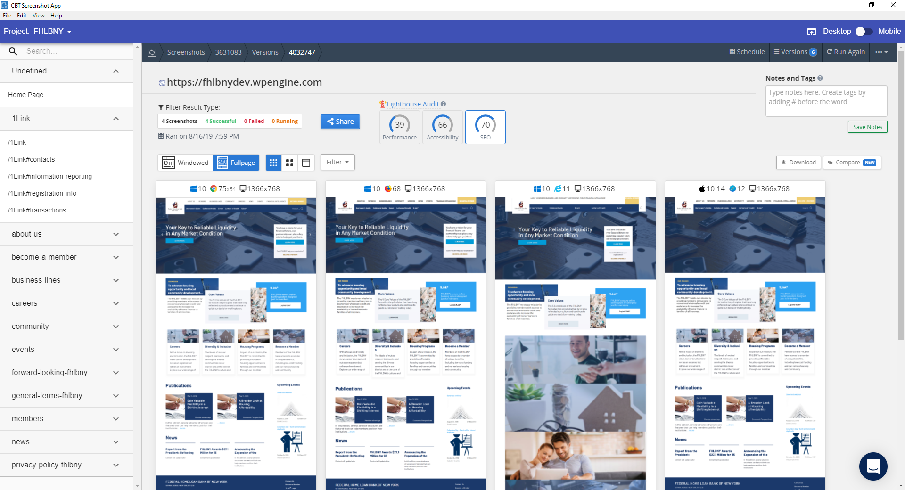
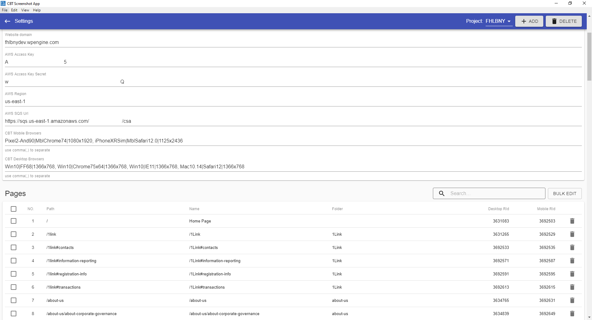

# CBT Screenshot App

The repo is an Electron app that using CrossBrowserTesting API to do batch screenshots and display the results.

## App dependencies
This app needs 4 services
1. A CrossBrowserTesting Unlimited Account
2. A Mongo DB: for save configs. The db can be remote host or local host.
3. AWS SQS: for trigger AWS Lambda
4. AWS Lambda: for Call CrossBrowserTesting API to take screenshots

## Development
There are 4 projects includes
1. common: shared code for electron and react
2. react: the UI APP
3. electron: the wrapper of the UI APP 
4. lambda: the screenshot task executor

Number 1 to 3 projects are written in Javascript and these projects are for the client App.
To launch the app in development mode, you have to open 3 terminals and run:

``` bash
# window 1 for common
$ cd common
$ npm run start

# window 2 for react
$ cd react 
$ npm run start

# window 3 for electron
$ cd electron
$ npm run start
```

Number 4 is written in C# and it is for AWS Lambda. It can be only executed by AWS Lambda.

## Deploy
The client app is deploy to GitHub Release. Our CI server will be triggered by git Tag Push and automatically push files to Github.

To manually build the client app. you have to open 3 terminals and run:
``` bash
# window 1 for common
$ cd common
$ npm run build

# window 2 for react
$ cd react 
$ npm run build

# window 3 for electron
$ cd electron
$ npm run build
```

For lambda project, run these command to deploy to AWS Lambda
``` bash
dotnet tool install -g Amazon.Lambda.Tools # for first time
dotnet lambda deploy-function cbt-screenshot-task # to upload files
```

### Note
your machine must have a "swarm" profile in your ~/.aws/credentials and ~/.aws/configs for deployment.

## App Demo Images
### Home Screen


### Setting Screen

